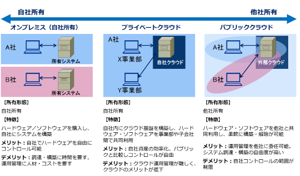

# クライドの概念に関する問題  

## 利用コスト  
    〇資本的支出（CapEx）  
    　物理サーバを購入するなどの設備コスト  
    〇運用費（OpEx）  
    　VMを従量課金で使用するコスト  

## データをクラウドに保存する上でのセキュリティ上のメリット  
    →ユーザーは自身のデータを完全に制御することができる  

    Azure側がデータにアクセスする権限はないため、データの保護たデータの監視は  
    ユーザーが行う必要がある  

## IaaSとか  
    このサイトが分かりやすかった  
    https://www.topgate.co.jp/blog/google-service/9883  

## フォールトトレランス  
    コンポーネントの1つに障害が発生しても、システムが利用可能な状態を維持できる性能のこと  

## ディザスタリカバリ（災害復旧）  
    地域の障害が発生しても、バックアップを利用してリソースを復元できる  

## スケーラビリティ（拡張性）  
    クラウド内のリソースを必要に応じて拡張できる性質のこと  
    負荷変動時にパフォーマンスを維持できること  

## 弾力性  
    クラウド内のリソースをアプリケーションを止めることなく動的に拡張／縮小できる性質のこと  
    リソースの割り当て量を動的に柔軟に変更できる  

## 機敏性（アジリティ）  
    アプリケーション要件の変更に応じて迅速にデプロイおよびリソース構成できる性質のこと  

## ハイブリットクラウド  
    以下の構成のこと  
    ・パブリッククラウドとプライベートクラウドを組み合わせた構成  
    ・オンプレとパブリッククラウドを組み合わせた構成  
    ・AzureとAWSのように複数のパブリッククラウドを組み合わせた構成  

    ちなみに、パブリッククラウドからも、プライベートクラウドからもハイブリットへの移行は可能  
  

## パブリッククラウドを利用して、内部ネットワークの拡張  
    パブリッククラウドの仮想ネットワークとオンプレのネットワークを結び付ければＯＫ  

    